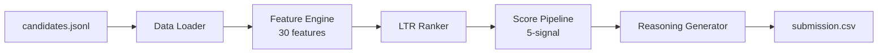

# India Runs — Intelligent Candidate Discovery & Ranking Engine

> Redrob AI Hackathon: Build the winning candidate ranking system.

## Architecture



## Approach

### 5-Signal Ranking Architecture

1. **Title/Career Fit** (weight: 0.30) — Is the candidate's actual career in AI/ML at product companies?
2. **Skill Match** (weight: 0.25) — Do they have the right skills, validated by proficiency, duration, and endorsements?
3. **Behavioral Signals** (weight: 0.20) — Are they actually available and responsive?
4. **Experience Alignment** (weight: 0.15) — Does their YOE and career trajectory match?
5. **Location/Education** (weight: 0.10) — Location preference and education quality.

### Anti-Trap Design

- **Keyword-stuffer elimination**: Non-tech titles (HR Manager, Marketing Manager, etc.) are forced to tier 0 regardless of listed AI skills.
- **Consulting-only penalty**: AI-title candidates with exclusive IT Services careers are heavily downweighted per JD requirements.
- **Honeypot detection**: Impossible profiles (timeline mismatches, expert proficiency with 0 endorsements, duplicate descriptions) are filtered.
- **Skill-title consistency**: Mismatch between title and listed skills triggers penalty.

## Quick Start

```bash
# Install dependencies (uv manages the venv + lockfile)
uv sync

# Copy dataset
gunzip -k dataset.zip
cp candidates.jsonl data/

# Run ranker (produces submission.csv)
uv run python rank.py --candidates data/candidates.jsonl --out submission.csv

# Validate submission
uv run python src/eval/validate.py submission.csv data/candidates.jsonl
```

## Compute Constraints

- Runtime: < 5 minutes on 100K candidates
- Memory: < 16 GB
- CPU only, no network during ranking
- No GPU, no LLM API calls

## Project Structure

```
india-runs/
├── rank.py                       # One-command entry point
├── pyproject.toml                # uv-managed dependencies + lockfile
├── src/
│   ├── ranker/
│   │   ├── config.py             # JD requirements, skill lists, weights
│   │   ├── pipeline.py           # Main ranking orchestration
│   │   ├── features.py           # 30-feature computation engine
│   │   ├── skill_matcher.py      # Skill matching with anti-stuffing
│   │   ├── title_classifier.py   # Title relevance tier assignment
│   │   ├── career_analyzer.py    # Career trajectory & product company detection
│   │   ├── behavioral_scoring.py # Redrob signals scoring
│   │   ├── location_scorer.py    # Location preference scoring
│   │   ├── honeypot_detector.py  # Honeypot identification & filtering
│   │   └── reasoning_generator.py# Per-candidate explanation generation
│   ├── data/
│   │   ├── loader.py             # Fast JSONL loading (orjson)
│   │   └── skill_ontology.py    # Skill relationships & normalization
│   └── eval/
│       ├── metrics.py            # NDCG@K, MRR, MAP, P@K, Recall@K
│       └── validate.py            # Submission format validation
├── api/                          # FastAPI demo backend
├── frontend/                     # React demo frontend
├── docker-compose.yml
└── docs/
    └── architecture.md
```

## Demo Stack

### Backend (FastAPI)
- `POST /api/rank` — Run ranker, return top 100 with explanations
- `GET /api/candidates` — Searchable candidate database
- `GET /api/candidates/{id}` — Full candidate detail with reasoning
- `GET /api/graph` — Skill relationship graph data

### Frontend (React + TypeScript)
- Landing page with pipeline visualization
- Live ranking reveal with animated transitions
- Candidate detail pages with skill radar, career timeline, DNA visualization
- Knowledge graph explorer

### Run the demo locally
```bash
# Backend (uv) — first /api/rankings call runs the real pipeline, then caches
uv run uvicorn api.main:app --port 8000

# Frontend (Vite dev server proxies /api -> :8000)
cd frontend && npm install && npm run dev
```

### Deployment
```bash
docker compose up -d
```

## Reproduce

```bash
uv run python rank.py --candidates ./data/candidates.jsonl --out ./submission.csv
```

## Team

- Built for the Redrob AI Hackathon — Intelligent Candidate Discovery & Ranking Challenge

## License

MIT
